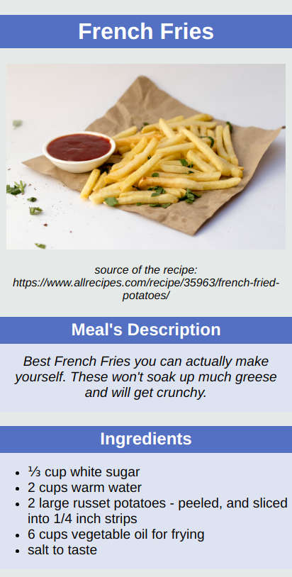

# Odin Project #1: Recipes

The goal of this Odin Project assignment was to create a simple website with three different recipes found on allrecipes.com. The website looks quite terrible but the goal of the project was to get started with HTML and CSS and practice the fundamentals.

I started and finished this project in December 2021. 

## Assignment

[The Odin Project - Foundations - #1 Recipes](https://www.theodinproject.com/lessons/foundations-recipes)

## Technology

- HTML
- CSS

## Key Concepts

- HTML boilerplate
- HTML tags
- CSS type, class and ID selectors
- Grouping and chaining selectors
- CSS cascade, specificity and inheritance
- Git: commits and pushing to main

## Links

[Live Demo](https://brightneon7631.github.io/odin-recipes/)

[My Other Projects](https://brightneon7631.github.io/odin-scrimba-projects/)

## Screenshots

### Desktop


### Mobile



## Sources for recipes and images

- https://www.allrecipes.com/recipe/158140/spaghetti-sauce-with-ground-beef/
- https://www.allrecipes.com/recipe/263255/pan-fried-salmon-in-curry-cream-sauce/
- https://www.allrecipes.com/recipe/35963/french-fried-potatoes/
- https://unsplash.com/photos/sA3wymYqyaI by Homescreenify
- https://unsplash.com/photos/t05q7TZObzc by Micheile Henderson
- https://unsplash.com/photos/jUPOXXRNdcA by Brooke Lark
- https://unsplash.com/photos/8YBHgP0WrEo by Pixzolo Photography
  

## Deployment

```bash
  git clone
```
